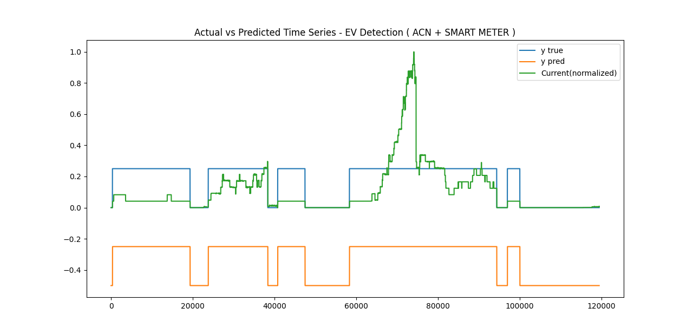
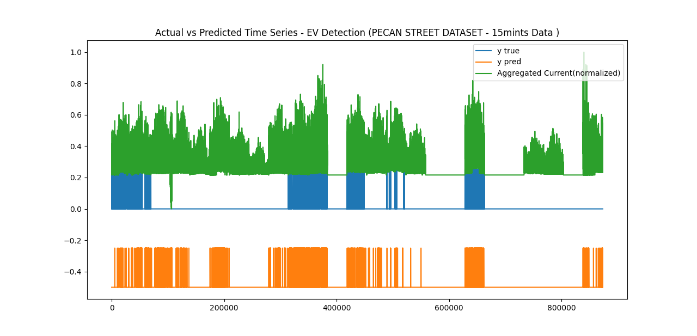
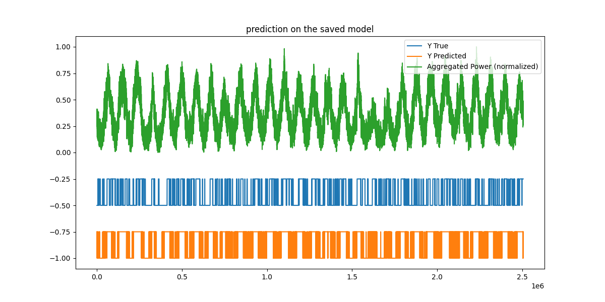

# Electric Vehicle's Charge Event Detection using Smart Meter Data ( 1D CNN LSTM and GRU)

## Problem  

The number of electric vehicles growing rapidly over time which affects the power distribution boards operate the loads dynamically and unpredictable load shortage in many circumstances.
The solution can be achieved at the house level which needs a large number of smart meters should be installed in every individual house which will cause huge costs and maintenance. Still, few market players are doing the load disaggregation at the house level. 
The optimized solution needs to be solved at the Distribution transformer(DT) level which can be cost-effective and low maintenance by installing a smart meter in every individual DTs.

## Objective
To develop the AI model that can predict EV charging events in the distribution transformer level in real-time on the edge computing device or postpartum data analytics.

## DataSet Used
1. Pecan Street Data set (50 houses with individual electric appliance and their power data including EVs) 
https://www.pecanstreet.org/dataport/
2. Smart Meter Data from Private Organization   
3. ACN EV Charging Data https://ev.caltech.edu/dataset

## Deeplearning Models Used
- LSTM https://en.wikipedia.org/wiki/Long_short-term_memory
- GRU https://en.wikipedia.org/wiki/Gated_recurrent_unit

#### Python Packages used in this Repository
- numpy 
- tqdm
- pandas
- keras
- matplotlib
- sklearn
- tensorflow


use **requirements.txt** to install the packages on your environment
```buildoutcfg
pip install -r requirements.txt
```


## ACN + Smart meter data Model Prediction  ( Household level )


## Pecan Street Data Model Prediction ( Household level )


## Pecan Street Data Model Prediction ( Distribution Transformer level )


### Training Results on GRU
```buildoutcfg
               precision    recall  f1-score 

            0       1.00      1.00      1.00  
            1       0.89      0.92      0.91   

     accuracy                           0.99   
    macro avg       0.95      0.96      0.95   
 weighted avg       0.99      0.99      0.99  
```

### Training Results on LSTM
```buildoutcfg
                precision    recall  f1-score 

            0       0.99      1.00      0.99   
            1       0.83      0.80      0.81   

     accuracy                           0.99  
    macro avg       0.91      0.90      0.90  
 weighted avg       0.99      0.99      0.99   
```
